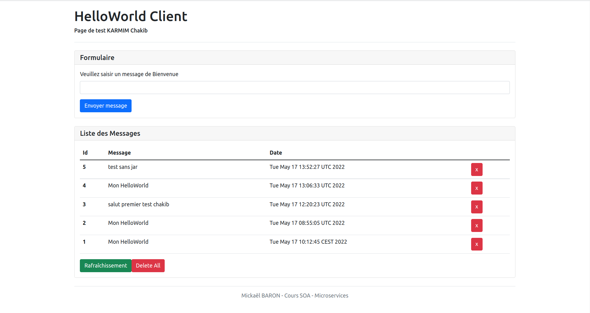

## TP AAW - KARMIM Chakib

#### pré-info : 
	* Docker : 20.10.16
	* java : openjdk 11.0.15
	* curl : 7.58.0
	* maven : 3.6.0
	* OS : Linux - Ubuntu
	* Browser : Brave 

#### Exo-1

	* Ajout des depency dans le pom.xml
	* Ajout de Kumuluz dans les propreties
	* Création d'une config d'exec HelloworldRestMicroService
	* Ajout de maven-dependency-plugin 
	* java -cp 'target/classes:target/dependency/*' com.kumuluz.ee.EeApplication ( marche )
###### complet
#### Exo-2

	* Récuperation de redis depuis Docker Hub
	* docker run --name redis -v $(pwd)/data:/data -d redis redis-server --appendonly yes ( marche )
###### complet
#### Exo-3
	* Redirigation de port -p 6379:6379 
	* Utilisation de l'outil cUrl pour tester le service web ( marche)
###### complet
#### Exo-4
	Dans le dossier helloworldrestmicroservice :
		- Dockerfile : utilisation d'un JDK / installation de curl et maven / construction de package maven enfin demarer le programme sur le port 8080 ~= 546Mo
		- DockerfileJarRun : on passe par un jre on génére un .jar qu'on utilise pour démarer notre programme sur le 8080 ~= 246Mo			
		- DockerfileMSB :  découpe le processe sur deux partie compilation et execution ~= 247Mo
	
	* docker build -t mickaelbaron/helloworldrestmicroservice -f DockerfileXXX . ( marche avec les trois fichier ) 
###### complet
#### Exo-5
	* Création de network 'docker network create helloworldnetwork'
	* Association du conteneur 'docker network connect helloworldnetwork redis'
	* Création de conteneur depuis un network 
	* Ajout de variable d'environnement à la création du conteneur 
	* requete cUrl marche
###### complet
#### Exo-6

	* Ajout de Rabbitmq 
	* Recreation des conteneurs redis - rest - log - rabbitmq
	* l'interface admine RabbitMQ fonctionne
	* requete cUrl marche 
###### complet
#### Exo-7 
	(complet)
	* Création du fichier docker-compose.yml
	* Création des images de conteneurs avec docker-compose
	* Ajout de message sur http://localhost fonctionne
###### complet
#### Probléme rencontrer  :  
	* Prob de permission dans n'importe quelle commande docker ( il fallait tout executer en sudo )
	* docker rm -f $(docker ps -q) ne marche pas sous linux pour faire une table rase 
	* Au cas ou on crée l'image on utilisant un dockerfile avec un .jar notre appli web ne marche pas 
	* manque de org.sfl4j ( mais ça fontionne même si ça renvoie une erreur ) 
	* quand j'ai changer des petits details dans mes page Vue.js une simple ' docker compose build web ' ne marche pas 
	  il faillait refaire un ' docker compose up -d'
    * J'ai essayer d'ajouter du css dans la page html en head sous la form link ,  et dans les fichier Vue.js par fois ça execute par fois non
      mais ça n'a jamais marcher

#### Capture

